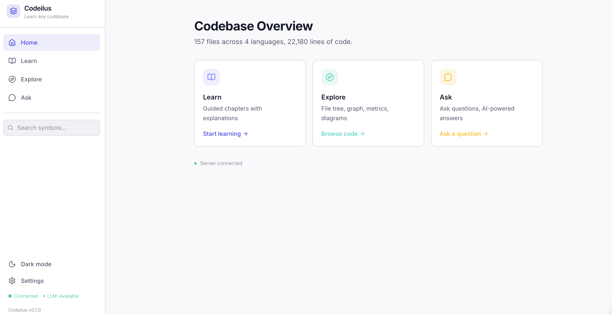
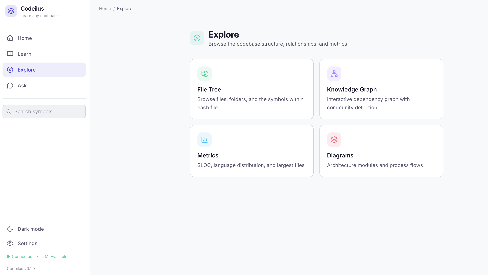

# Codeilus

**Turn any codebase into an interactive learning experience.**

[](https://www.rust-lang.org/)
[](LICENSE)
[](https://github.com/mbaneshi/codeilus/actions)

Codeilus is a single Rust binary that analyzes any codebase and transforms it
into a gamified, browser-based learning experience -- complete with a 3D graph
explorer, guided chapters, AI-powered Q&A, and auto-generated quizzes.





---

## Install

### Homebrew (macOS & Linux)

```bash
brew tap mbaneshi/codeilus
brew install codeilus
```

### Cargo

```bash
cargo install --git https://github.com/mbaneshi/codeilus.git codeilus-app
```

### Pre-built Binaries

Download from [GitHub Releases](https://github.com/mbaneshi/codeilus/releases) for macOS (ARM/Intel) and Linux (x86_64/ARM64).

### From Source

```bash
git clone https://github.com/mbaneshi/codeilus.git
cd codeilus && cargo build --release
```

---

## Quick Start

```bash
codeilus analyze ./your-repo
codeilus serve
# Open http://localhost:4174
```

Or simply:

```bash
codeilus ./your-repo
# Analyzes and serves in one step
```

## Key Features

- **8-step analysis pipeline** -- parse, graph, metrics, analyze, narrate, learn, harvest, export
- **16 focused Rust crates** -- each with a single responsibility and clean dependency boundaries
- **3D graph visualization** -- explore files, symbols, and dependencies interactively
- **AI-generated chapters** -- pedagogically ordered explanations of how the codebase works
- **Quizzes and gamification** -- test understanding with auto-generated questions
- **Light & dark themes** -- switch with one click
- **Claude Code CLI integration** -- use as an MCP tool from Claude Code
- **Incremental parsing** -- re-analyze only what changed
- **SQLite storage** -- portable, zero-config persistence

## Architecture

Codeilus is organized as a Cargo workspace of 16 crates:

```
codeilus-core       Contract types, IDs, traits (zero internal deps)
codeilus-db         SQLite repositories (depends only on core)
codeilus-parse      Tree-sitter incremental parsing
codeilus-graph      Dependency graph + community detection
codeilus-metrics    Complexity, churn, coupling metrics
codeilus-analyze    Pattern detection
codeilus-diagram    Architecture diagram generation
codeilus-search     Full-text symbol search
codeilus-llm        LLM provider abstraction (Claude, OpenAI, Ollama)
codeilus-narrate    LLM-powered narrative generation
codeilus-learn      Learning path and quiz generation
codeilus-harvest    GitHub trending repo scraper
codeilus-export     Static site export
codeilus-mcp        Model Context Protocol server
codeilus-api        Axum HTTP/WebSocket API + embedded frontend
codeilus-app        CLI entry point
```

The frontend is a SvelteKit 5 application embedded into the binary via `rust-embed`.

Data flows: **parse** -> **graph** -> **metrics** -> **analyze** -> **narrate** -> **learn** -> **export**

## Tech Stack

| Layer     | Technology              |
|-----------|-------------------------|
| Backend   | Rust, Tokio, Axum       |
| Frontend  | SvelteKit 5, Tailwind 4 |
| Database  | SQLite (rusqlite, r2d2) |
| Parsing   | tree-sitter             |
| AI        | Claude Code CLI         |
| CLI       | clap                    |

## Development

```bash
cargo build          # build all crates
cargo test           # run all tests (268+)
cargo clippy         # must be zero warnings
cargo test -p codeilus-parse   # test single crate
```

## Documentation

- [Docs Site](https://mbaneshi.github.io/codeilus/) -- Full documentation
- [NORTH_STAR.md](NORTH_STAR.md) -- Vision, architecture, and roadmap
- [CLAUDE.md](CLAUDE.md) -- Agent instructions and architecture rules

## Contributing

Contributions are welcome. Please run `cargo clippy` and `cargo test` before submitting a pull request.

## License

[MIT](LICENSE)
