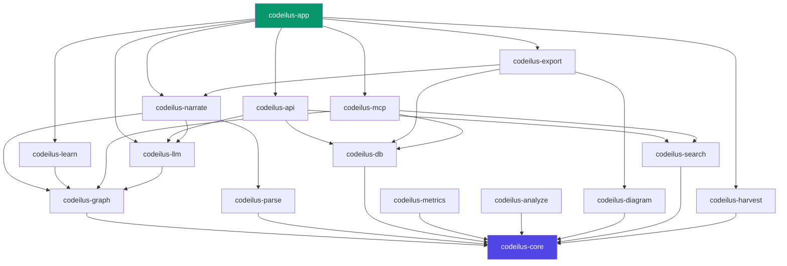

# Crate Map

Codeilus is a Rust workspace with 16 crates.

## Dependency Graph

## Crate Descriptions

### Foundation

| Crate | Purpose |
|---|---|
| `codeilus-core` | Events, errors, typed IDs, EventBus. **Zero internal dependencies.** Read-only after Sprint 0. |
| `codeilus-db` | SQLite WAL, migrations, BatchWriter, repository structs for all 20 tables. |
| `codeilus-app` | Binary: clap CLI, DB setup, server lifecycle, shutdown. |

### Analysis Pipeline

| Crate | Purpose |
|---|---|
| `codeilus-parse` | Tree-sitter parsing for 6 languages (Python, TypeScript, JavaScript, Rust, Go, Java); 7 more defined but pending grammar integration. Extracts symbols, imports, calls, heritage. |
| `codeilus-graph` | Knowledge graph: call graph, dependency graph, heritage, communities (Louvain), entry points, execution flows. |
| `codeilus-metrics` | SLOC, fan-in/out, complexity, modularity, TF-IDF, git churn, heatmaps. |
| `codeilus-analyze` | Anti-pattern detection: god classes, long methods, circular deps, security hotspots. |
| `codeilus-diagram` | Mermaid diagrams: architecture subgraphs, function flowcharts, ASCII file trees. |

### AI & Content

| Crate | Purpose |
|---|---|
| `codeilus-llm` | Provider-agnostic LLM trait, Claude Code CLI implementation, stream-json parsing. |
| `codeilus-narrate` | Pre-generates 8 narrative types at analysis time. Placeholder fallback when LLM unavailable. |
| `codeilus-learn` | Curriculum generation, progress tracking, XP/badges, quiz generation. |
| `codeilus-search` | BM25 full-text search via SQLite FTS5 with RRF ranking. |

### Publishing

| Crate | Purpose |
|---|---|
| `codeilus-harvest` | GitHub trending scraper, shallow clone queue, repo fingerprinting. |
| `codeilus-export` | Static single-HTML renderer with all data inlined. |
| `codeilus-mcp` | MCP stdio server with 16 tools for AI agent integration (query, context, impact, explain, diagram, metrics, learning, and more). |

### Frontend

| Component | Purpose |
|---|---|
| `codeilus-api` | Axum HTTP + WebSocket + rust-embed SPA. Routes for all API endpoints. |
| `frontend/` | SvelteKit 5 + TailwindCSS 4. Compiled to static files and embedded in the binary. |

## Architecture Rules

- `codeilus-core` has **zero** internal dependencies
- `codeilus-db` depends only on `core`
- All other crates depend on `core` + `db`
- **No cross-dependencies** between sibling crates (e.g., parse must not depend on graph)
- All public types go through `core` if shared across crates
- IDs are i64 newtype wrappers &mdash; never raw i64 or UUID
