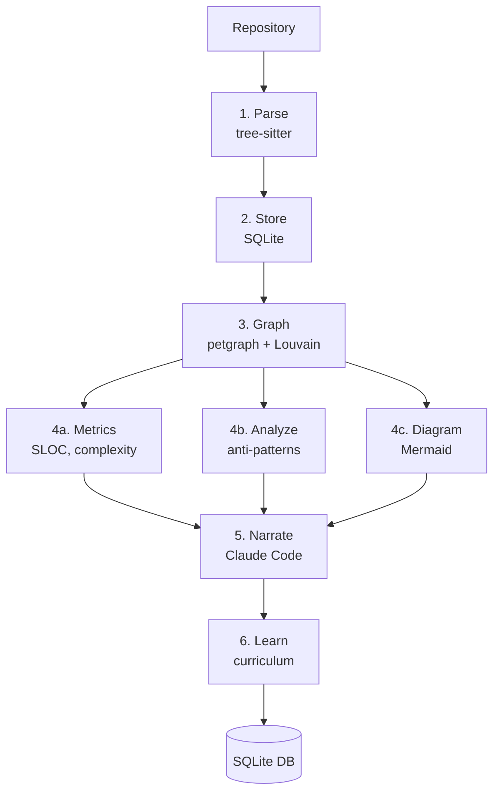

# Data Flow

## Analysis Pipeline



### Step Details

| Step | Input | Output | Parallel? |
|---|---|---|---|
| Parse | File system | `ParsedFile[]` (symbols, imports, calls, heritage) | Yes (rayon) |
| Store | `ParsedFile[]` | SQLite rows (files, symbols) | No |
| Graph | Stored data | `KnowledgeGraph` (petgraph + communities + entry points) | No |
| Metrics | Parsed files + graph | Complexity, fan-in/out, heatmap scores | Yes (rayon) |
| Analyze | Parsed files + graph | Pattern detections (god class, circular dep, etc.) | Yes |
| Diagram | Graph | Mermaid strings | No |
| Narrate | Graph + context | 8 narrative types stored in DB | Sequential (LLM calls) |
| Learn | Graph + metrics | Chapters, sections, quizzes | No |

## Interactive Server Flow

```
Browser <---- SvelteKit 5 (embedded) ----> Axum API ----> SQLite
   |                                          |
   +--- WebSocket <-- EventBus (broadcast) ---+
                          |
                    Claude Code CLI
                    (subprocess, stream-json)
```

- **REST API** serves all read endpoints (files, symbols, graph, communities, chapters, etc.)
- **SSE** streams Q&A responses from Claude Code
- **WebSocket** pushes real-time events during analysis

## Harvest Pipeline

```
GitHub Trending --> codeilus-harvest --> shallow clone queue
                                              |
                                    codeilus analyze (full pipeline)
                                              |
                                    codeilus-export --> single HTML per repo
                                              |
                                    codeilus deploy --> Cloudflare Pages
```
