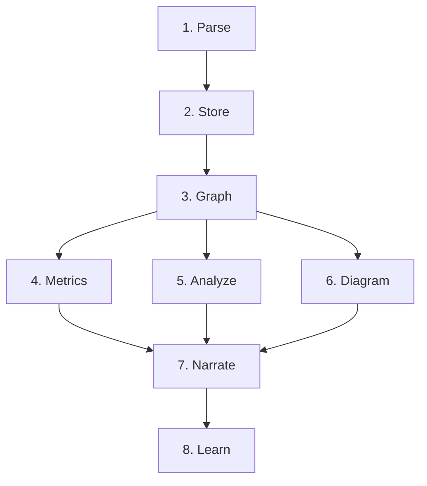

# How It Works

Codeilus runs an 8-step analysis pipeline, then serves the results through an interactive browser UI.

## The Pipeline

### 1. Parse (`codeilus-parse`)

Tree-sitter extracts symbols, imports, calls, and heritage from every file. Supports Python, TypeScript, JavaScript, Rust, Go, Java, and more.

- Respects `.gitignore`
- Parallel parsing via `rayon`
- 20MB byte budget with chunked processing

### 2. Store (`codeilus-db`)

Parsed data is persisted to SQLite (WAL mode). 20 tables across 7 domains: core, graph, metrics, narratives, learning, harvest, and system.

### 3. Graph (`codeilus-graph`)

Builds a knowledge graph from parsed data:

- **Call graph** &mdash; symbol name matching with confidence scoring
- **Dependency graph** &mdash; resolved imports to file-level edges
- **Heritage graph** &mdash; extends/implements relationships
- **Communities** &mdash; Louvain algorithm on `petgraph`
- **Entry points** &mdash; heuristic scoring (main, handlers, CLI)
- **Execution flows** &mdash; BFS from entry points through call edges

### 4. Metrics (`codeilus-metrics`)

SLOC, fan-in/out, cyclomatic complexity, modularity score, TF-IDF keywords, git churn/contributors, and heatmap scoring.

### 5. Analyze (`codeilus-analyze`)

Pattern detection: god classes, long methods, circular dependencies, security hotspots, and test coverage gaps.

### 6. Diagram (`codeilus-diagram`)

Auto-generated Mermaid diagrams: architecture (communities as subgraphs), function flowcharts (AST to IR), and ASCII file trees.

### 7. Narrate (`codeilus-narrate`)

Claude Code generates 8 types of narrative content:

| Kind | What It Produces |
|---|---|
| Overview | "What it does, for who, why it matters" |
| Architecture | "How it's structured" |
| Reading Order | "Read these 3-5 files to understand 80%" |
| Extension Guide | "How to add features" |
| Contribution Guide | "How to contribute" |
| Why Trending | "Why developers care" |
| Module Summary | Per-community explanation |
| Symbol Explanation | Per-symbol on-demand |

All narratives are stored in the database and served instantly &mdash; no LLM latency at read time.

### 8. Learn (`codeilus-learn`)

Transforms the graph into a gamified curriculum:

- Topological sort of communities by dependency
- Chapter 0: The Big Picture
- Per-community chapters with sections
- Difficulty ratings from complexity metrics
- Quiz generation from graph data
- XP, badges, and streak tracking
